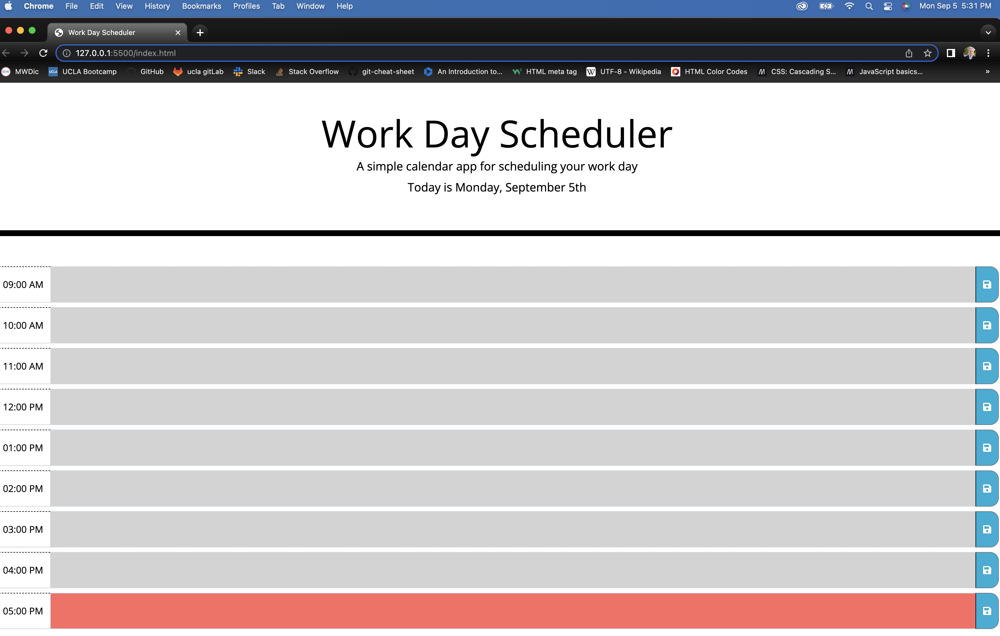

  
  <h1 align="center">A simple calendar app for scheduling your work day.</h1>

## LINKS
<a href="https://lujansolo.github.io/workday-scheduler/">Work Day Scheduler: LIVE SITE
 

<a href="https://github.com/LujanSolo/workday-scheduler/">LujanSolo's Github Repository</a> 

 

## Table of Contents

- [Description](#description)
- [Motivation](#motivation)
- [Usage](#usage)
- [Contributors](#contributors)
- [License](#license)
  

## Description

This app is a quick and easy way to keep yourself on track each day. From 9am to 5pm, each hour has a dedicated row for a quick note or two. Save it, go to lunch, bring the webpage back up, and all of your saved entries will remain in place.  
Stay on target time with color-coded hours! Green fields are future hours, the red field is your current hour (hurry up!), and grey input fields are in the past; no looking back!  

## Motivation
Our daily minutia is oftentimes too much with which to upkeep on short-term memory alone. By creating an hourly workday scheduler, the tiny tasks that usually get lost in the mix will now have a front-row seat on your personal webpage.  

## Usage

  The page is linked to moment.js for the current date and time.

  To make a new entry, select the input area between the HOUR on the left and the SAVE BUTTON on the right. Once you've entered your note, click on the SAVE ICON and the Workday Scheduler will remember it! Enter a new note and re-save in the same hour slot to overwrite, if necessary.

  Upon the page loading, any pre-existing notes will load into the entry fields.  
  

  

## Contributors

<table>
  <tr>
    <td align="center"><a href="https://github.com/LujanSolo"> <b>Jamie Lujan</b></a> <a href="https://github.com/LujanSolo/workday-scheduler/commits/main" title="Design">🎨</a> <a href="https://github.com/LujanSolo/workday-scheduler/commits/main" title="Code">💻</a></td>
</table> 

## External Sources

<a title="momentJS" href="https://momentjs.com/">Moment.js 2.29.4</a>
  

## License

MIT License

Copyright (c) 2022 camilleyong

Permission is hereby granted, free of charge, to any person obtaining a copy
of this software and associated documentation files (the "Software"), to deal
in the Software without restriction, including without limitation the rights
to use, copy, modify, merge, publish, distribute, sublicense, and/or sell
copies of the Software, and to permit persons to whom the Software is
furnished to do so, subject to the following conditions:

The above copyright notice and this permission notice shall be included in all
copies or substantial portions of the Software.

THE SOFTWARE IS PROVIDED "AS IS", WITHOUT WARRANTY OF ANY KIND, EXPRESS OR
IMPLIED, INCLUDING BUT NOT LIMITED TO THE WARRANTIES OF MERCHANTABILITY,
FITNESS FOR A PARTICULAR PURPOSE AND NONINFRINGEMENT. IN NO EVENT SHALL THE
AUTHORS OR COPYRIGHT HOLDERS BE LIABLE FOR ANY CLAIM, DAMAGES OR OTHER
LIABILITY, WHETHER IN AN ACTION OF CONTRACT, TORT OR OTHERWISE, ARISING FROM,
OUT OF OR IN CONNECTION WITH THE SOFTWARE OR THE USE OR OTHER DEALINGS IN THE
SOFTWARE.

